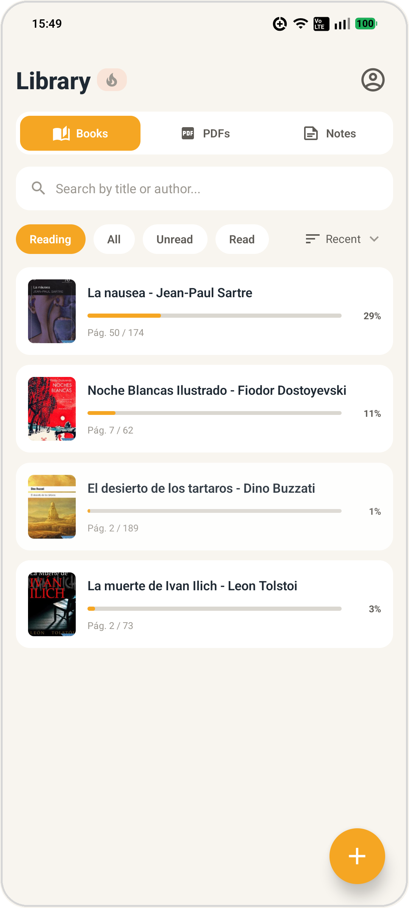
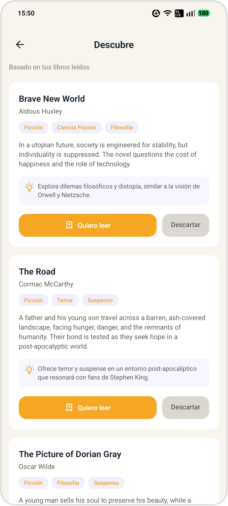
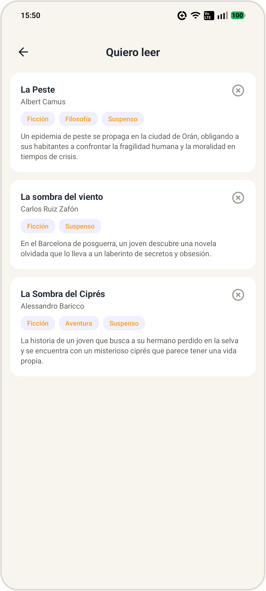

# Vellum

App móvil de lectura enfocada en libros, notas y lectura sin distracciones.

<table align="center">
  <tr>
    <td align="center">
       
      <b>Biblioteca</b>
    </td>
    <td align="center">
       
      <b>Descubre</b>
    </td>
    <td align="center">
       
      <b>Quiero leer</b>
    </td>
  </tr>
</table>

## Por qué existe

La mayoría de apps de lectura te dejan abrir un libro y ya — perder el hilo de una idea que quisiste anotar, o no tener forma de retomar dónde ibas en otro dispositivo, es parte del trato. Vellum junta biblioteca, lector, notas y estadísticas de lectura en un solo lugar: **abre donde lo dejaste, guarda ideas rápido, y sigue leyendo**.

## Features

- 📚 Biblioteca de EPUB (PDF y Markdown en progreso) con búsqueda, filtros y géneros extraídos por IA
- 📖 Lector nativo con progreso sincronizado entre dispositivos, fuentes personalizables y caché offline
- ✍️ Highlights y notas por libro, con colores y vista global agrupada
- 🤖 Resúmenes de capítulo generados con IA bajo demanda
- 🔮 **Discover** — recomendaciones de libros con IA basadas en lo que ya leíste
- 📊 Rachas y estadísticas de lectura
- 📱 Widget de Android con carrusel de highlights

## Stack

React Native · TypeScript · Zustand · Reanimated · react-native-readium

> API en Express + PostgreSQL: **[vellum_backend](https://github.com/Hector0122/vellum_backend)**

## Licencia

MIT — ver [LICENSE](LICENSE)
